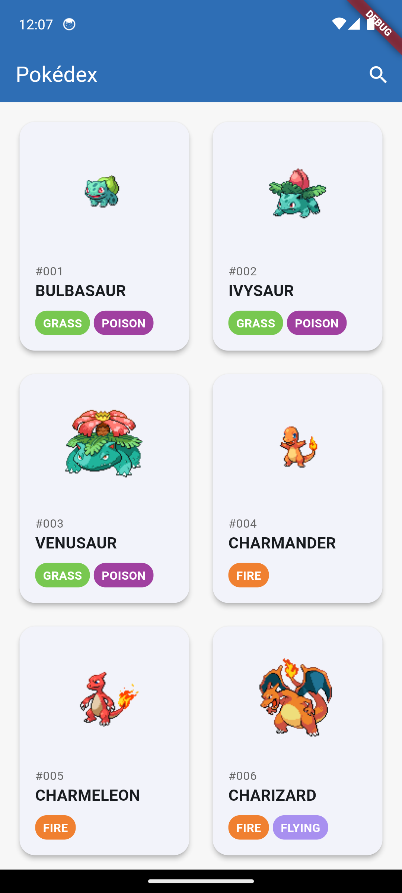
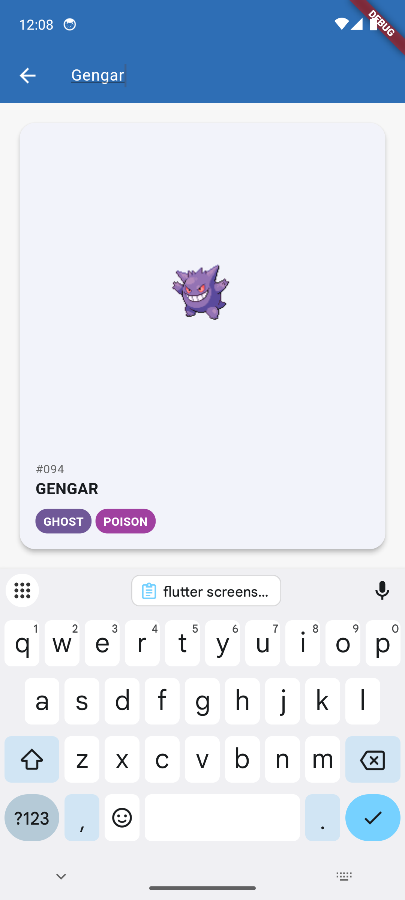
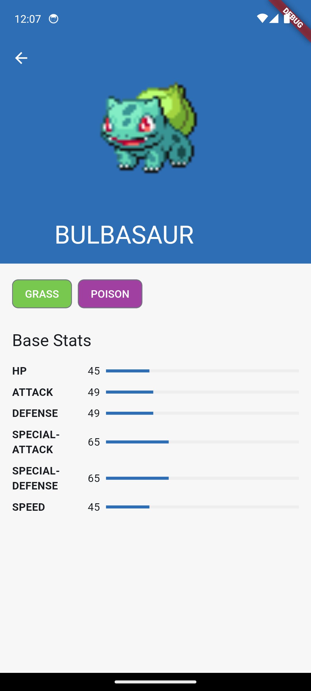

Pokédex App

A modern Flutter application that showcases Pokémon information using the PokéAPI. Built with Clean Architecture principles and modern Flutter development practices.

Screenshots

  

Features

Browse through Pokémon list

View detailed Pokémon information

Clean and intuitive UI with Material Design

Responsive layout that works on various screen sizes

Architecture

The project follows Clean Architecture principles with a clear separation of concerns:

Copylib/

├── core/                  # Core functionality and utilities

│   ├── di/               # Dependency injection setup

│   ├── error/            # Error handling

│   ├── network/          # Network related code

│   ├── usecases/         # Base usecase definitions

│   └── utils/            # Utility functions

├── features/             # Feature modules

│   └── pokemon/          # Pokemon feature

│       ├── data/         # Data layer

│       ├── domain/       # Domain layer

│       └── presentation/ # Presentation layer

Technical Stack

State Management

flutter_bloc: ^8.1.3 - For robust state management

bloc: ^8.1.4 - Core bloc library

Networking

dio: ^5.3.3 - HTTP client

retrofit: ^4.0.3 - Type-safe HTTP client

internet_connection_checker: ^1.0.0 - Network connectivity checking

Dependency Injection

get_it: ^7.6.4 - Service locator

injectable: ^2.3.2 - Code generation for dependency injection

Code Generation & Architecture

freezed: ^2.4.5 - Data class generation

json_serializable: ^6.7.1 - JSON serialization

dartz: ^0.10.1 - Functional programming features

Development Tools

build_runner: ^2.4.6

flutter_lints: ^4.0.0

Getting Started

Prerequisites

Flutter SDK ^3.5.3

Dart SDK ^3.5.3

Installation

Clone the repository

git clone [repository-url]

Install dependencies

flutter pub get

Run code generation

flutter pub run build_runner build --delete-conflicting-outputs

Run the app

flutter run

Project Structure

Clean Architecture Layers

Presentation Layer (presentation/)

bloc/ - BLoC state management

pages/ - UI screens

widgets/ - Reusable UI components

theme/ - App theming

Domain Layer (domain/)

entities/ - Business objects

repositories/ - Repository interfaces

usecases/ - Business logic

Data Layer (data/)

datasources/ - Remote and local data sources
models/ - Data models
repositories/ - Repository implementations

State Management
The app uses BLoC pattern for state management with two main blocs:

PokemonListBloc - Manages the list of Pokémon
PokemonDetailBloc - Manages individual Pokémon details

Upcoming Features

Caching implementation

Dark theme support

Custom transitions

Search functionality

Filtering options

Contributing

Contributions are welcome! Please feel free to submit a Pull Request.

License

This project is licensed under the MIT License - see the LICENSE file for details.

Acknowledgments

PokéAPI for providing the Pokémon data

Flutter and Dart team for the amazing framework
